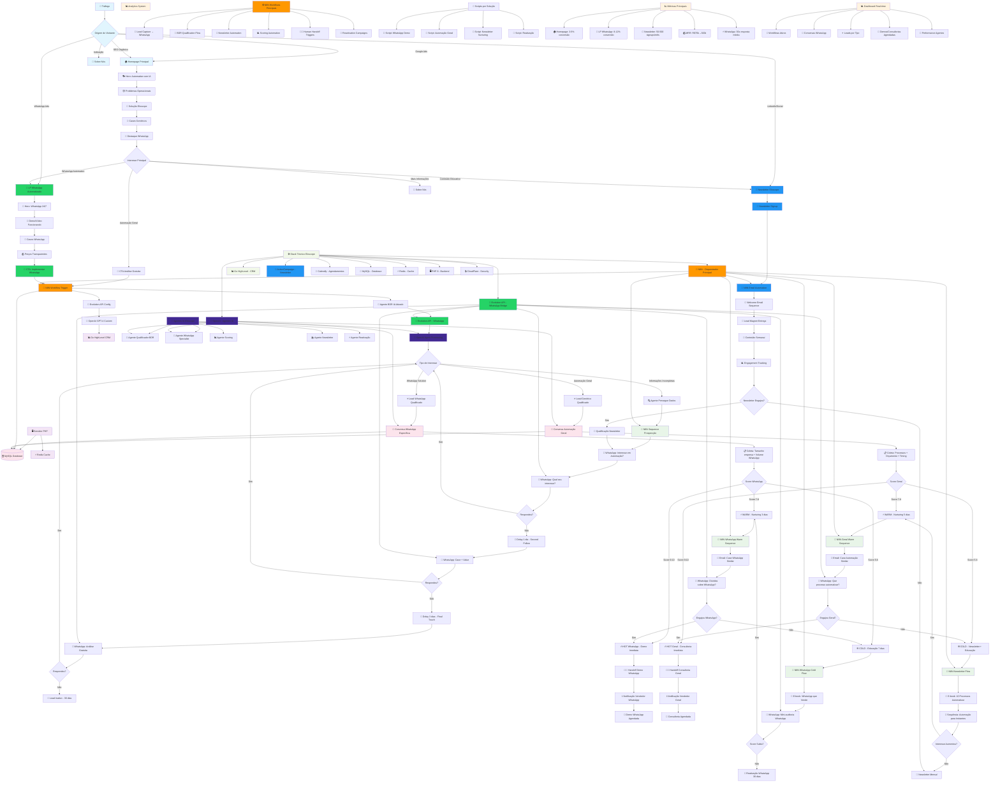

```mermaid
flowchart TD
    %% === ENTRADA DE TRÁFEGO ===
    A[👥 Tráfego] --> B{Origem do Visitante}
    B -->|Google Ads| C[🏠 Homepage Principal]
    B -->|SEO Orgânico| C
    B -->|WhatsApp Ads| D[🤖 LP WhatsApp Automatizado]
    B -->|LinkedIn/Social| E[📧 Newsletter Eloscope]
    B -->|Indicação| F[👥 Sobre Nós]
    
    %% === ARQUITETURA TÉCNICA ===
    G[(🗄️ MySQL Database)]
    H[🖥️ Servidor PHP]
    I[⚡ Redis Cache]
    J[📊 Analytics System]
    
    %% === HOMEPAGE AGÊNCIA AUTOMAÇÃO ===
    C --> K[🎭 Hero: Automatize com IA]
    K --> L[😰 Problemas Operacionais]
    L --> M[🏢 Solução Eloscope]
    M --> N[💼 Cases Genéricos]
    N --> O[📱 Destaque WhatsApp]
    O --> P{Interesse Principal}
    
    %% === FLUXO DE INTERESSE ===
    P -->|WhatsApp Automation| D
    P -->|Automação Geral| Q[📅 CTA Análise Gratuita]
    P -->|Mais Informações| R[👥 Sobre Nós]
    P -->|Conteúdo Educativo| E
    
    %% === LP WHATSAPP ESPECÍFICA ===
    D --> S[🤖 Hero: WhatsApp 24/7]
    S --> T[🎯 Demo/Vídeo Funcionando]
    T --> U[💼 Cases WhatsApp]
    U --> V[💰 Preços Transparentes]
    V --> W[📅 CTA: Implementar WhatsApp]
    
    %% === SISTEMA N8N AUTOMATION ===
    Q --> X[🔧 N8N Workflow Trigger]
    W --> X
    E --> Y[📧 Newsletter Signup]
    Y --> Z[🔧 N8N Email Automation]
    
    X --> AA[🤖 Agente BDR IA Ativado]
    AA --> BB[📱 Evolution API - WhatsApp]
    BB --> CC[🧠 OpenAI Agent Processing]
    
    %% === QUALIFICAÇÃO GENÉRICA ===
    CC --> DD{Tipo de Interesse}
    DD -->|WhatsApp Solution| EE[⭐ Lead WhatsApp Qualificado]
    DD -->|Automação Geral| FF[⭐ Lead Genérico Qualificado]
    DD -->|Informações Incompletas| GG[🔍 Agente Persegue Dados]
    
    %% === AGENTE BDR WORKFLOWS ===
    GG --> HH[🎯 N8N Sequence Prospecção]
    HH --> II[📅 Delay 2h - Primeiro Follow]
    II --> JJ[💬 WhatsApp: Qual seu interesse?]
    JJ --> KK{Respondeu?}
    KK -->|Sim| DD
    KK -->|Não| LL[📅 Delay 1 dia - Second Follow]
    LL --> MM[💬 WhatsApp: Case + Value]
    MM --> NN{Respondeu?}
    NN -->|Sim| DD
    NN -->|Não| OO[📅 Delay 3 dias - Final Touch]
    OO --> PP[💬 WhatsApp: Análise Gratuita]
    PP --> QQ{Respondeu?}
    QQ -->|Sim| DD
    QQ -->|Não| RR[🚫 Lead Inativo - 30 dias]
    
    %% === AUTOMAÇÃO QUALIFICADOS ===
    EE --> SS[🤖 Conversa WhatsApp Específica]
    FF --> TT[🤖 Conversa Automação Geral]
    
    SS --> UU[📋 Coleta: Tamanho empresa + Volume WhatsApp]
    TT --> VV[📋 Coleta: Processos + Orçamento + Timing]
    
    UU --> WW{Score WhatsApp}
    VV --> XX{Score Geral}
    
    WW -->|Score 9-10| YY[🔥 HOT WhatsApp - Demo Imediata]
    WW -->|Score 7-8| ZZ[⚡ WARM - Nurturing 3 dias]
    WW -->|Score 5-6| AAA[❄️ COLD - Educação 7 dias]
    
    XX -->|Score 9-10| BBB[🔥 HOT Geral - Consultoria Imediata]
    XX -->|Score 7-8| CCC[⚡ WARM - Nurturing 5 dias]
    XX -->|Score 5-6| DDD[❄️ COLD - Newsletter + Educação]
    
    %% === HANDOFF INTELIGENTE ===
    YY --> EEE[👨‍💼 Handoff Demo WhatsApp]
    BBB --> FFF[👨‍💼 Handoff Consultoria Geral]
    EEE --> GGG[📞 Notificação Vendedor WhatsApp]
    FFF --> HHH[📞 Notificação Vendedor Geral]
    GGG --> III[📅 Demo WhatsApp Agendada]
    HHH --> JJJ[📅 Consultoria Agendada]
    
    %% === NURTURING SEQUENCES ===
    ZZ --> KKK[🔧 N8N WhatsApp Warm Sequence]
    CCC --> LLL[🔧 N8N Geral Warm Sequence]
    
    KKK --> MMM[📧 Email: Case WhatsApp Similar]
    LLL --> NNN[📧 Email: Case Automação Similar]
    
    MMM --> OOO[💬 WhatsApp: Dúvidas sobre WhatsApp?]
    NNN --> PPP[💬 WhatsApp: Que processo automatizar?]
    
    OOO --> QQQ{Engajou WhatsApp?}
    PPP --> RRR{Engajou Geral?}
    
    QQQ -->|Sim| YY
    RRR -->|Sim| BBB
    QQQ -->|Não| AAA
    RRR -->|Não| DDD
    
    %% === AUTOMAÇÃO EDUCACIONAL ===
    AAA --> SSS[🔧 N8N WhatsApp Cold Flow]
    DDD --> TTT[🔧 N8N Newsletter Flow]
    
    SSS --> UUU[📖 E-book: WhatsApp que Vende]
    TTT --> VVV[📖 E-book: 10 Processos Automatizar]
    
    UUU --> WWW[💬 WhatsApp: Mini-auditoria WhatsApp]
    VVV --> XXX[📧 Sequência: Automação para Iniciantes]
    
    WWW --> YYY{Score Subiu?}
    XXX --> ZZZ{Interesse Aumentou?}
    
    YYY -->|Sim| ZZ
    ZZZ -->|Sim| CCC
    YYY -->|Não| AAAA[🔄 Reativação WhatsApp 30 dias]
    ZZZ -->|Não| BBBB[🔄 Newsletter Mensal]
    
    %% === NEWSLETTER AUTOMATION ===
    Z --> CCCC[📧 Welcome Email Sequence]
    CCCC --> DDDD[📖 Lead Magnet Entrega]
    DDDD --> EEEE[📧 Conteúdo Semanal]
    EEEE --> FFFF[📊 Engagement Tracking]
    FFFF --> GGGG{Newsletter Engajou?}
    GGGG -->|Sim| HHHH[🎯 Qualificação Newsletter]
    GGGG -->|Não| BBBB
    
    HHHH --> II[💬 WhatsApp: Interesse em Automação?]
    
    %% === INTEGRAÇÕES TÉCNICAS ===
    X --> IIII[📱 Evolution API Config]
    IIII --> JJJJ[🧠 OpenAI GPT-4 Custom]
    JJJJ --> KKKK[📊 Go HighLevel CRM]
    
    %% === FERRAMENTAS ESPECÍFICAS ===
    LLLL[🛠️ Stack Técnico Eloscope]
    LLLL --> MMMM[🔧 N8N - Orquestrador Principal]
    LLLL --> NNNN[📱 Evolution API - WhatsApp Bridge]
    LLLL --> OOOO[🧠 OpenAI - Agentes IA]
    LLLL --> PPPP[📊 Go HighLevel - CRM]
    LLLL --> QQQQ[📧 ActiveCampaign - Newsletter]
    LLLL --> RRRR[📅 Calendly - Agendamentos]
    LLLL --> SSSS[💾 MySQL - Database]
    LLLL --> TTTT[⚡ Redis - Cache]
    LLLL --> UUUU[🖥️ PHP 8 - Backend]
    LLLL --> VVVV[🔒 CloudFlare - Security]
    
    %% === WORKFLOWS N8N ESPECÍFICOS ===
    WWWW[⚙️ N8N Workflows Principais]
    WWWW --> XXXX[🎯 Lead Capture → WhatsApp]
    WWWW --> YYYY[🤖 BDR Qualification Flow]
    WWWW --> ZZZZ[📧 Newsletter Automation]
    WWWW --> AAAAA[📊 Scoring Automation]
    WWWW --> BBBBB[👨‍💼 Human Handoff Triggers]
    WWWW --> CCCCC[🔄 Reactivation Campaigns]
    
    %% === AGENTES IA ESPECÍFICOS ===
    DDDDD[🤖 Agentes IA Eloscope]
    DDDDD --> EEEEE[🎯 Agente Qualificador BDR]
    DDDDD --> FFFFF[💬 Agente WhatsApp Specialist]
    DDDDD --> GGGGG[📊 Agente Scoring]
    DDDDD --> HHHHH[📚 Agente Newsletter]
    DDDDD --> IIIII[⚡ Agente Reativação]
    
    %% === SCRIPTS PERSONALIZADOS ===
    JJJJJ[📝 Scripts por Solução]
    JJJJJ --> KKKKK[🤖 Script: WhatsApp Demo]
    JJJJJ --> LLLLL[🎯 Script: Automação Geral]
    JJJJJ --> MMMMM[📧 Script: Newsletter Nurturing]
    JJJJJ --> NNNNN[🔄 Script: Reativação]
    
    %% === MÉTRICAS DE IMPACTO ===
    OOOOO[📈 Métricas Principais]
    OOOOO --> PPPPP[🏠 Homepage: 3-5% conversão]
    OOOOO --> QQQQQ[🤖 LP WhatsApp: 8-12% conversão]
    OOOOO --> RRRRR[📧 Newsletter: 50-500 signups/mês]
    OOOOO --> SSSSS[💰 MRR: R$75k→300k]
    OOOOO --> TTTTT[⚡ WhatsApp: 30s resposta média]
    
    %% === DASHBOARD OPERACIONAL ===
    UUUUU[📊 Dashboard Real-time]
    UUUUU --> VVVVV[🔄 Workflows Ativos]
    UUUUU --> WWWWW[💬 Conversas WhatsApp]
    UUUUU --> XXXXX[⭐ Leads por Tipo]
    UUUUU --> YYYYY[📅 Demos/Consultorias Agendadas]
    UUUUU --> ZZZZZ[🤖 Performance Agentes]
    
    %% === CONEXÕES BANCO DE DADOS ===
    H --> G
    H --> I
    X --> G
    SS --> G
    TT --> G
    
    %% === CONEXÕES N8N ===
    MMMM --> X
    MMMM --> HH
    MMMM --> KKK
    MMMM --> LLL
    MMMM --> SSS
    MMMM --> TTT
    MMMM --> Z
    
    %% === CONEXÕES AGENTES IA ===
    OOOO --> CC
    OOOO --> SS
    OOOO --> TT
    OOOO --> EEEEE
    OOOO --> FFFFF
    
    %% === CONEXÕES WHATSAPP ===
    NNNN --> BB
    NNNN --> JJ
    NNNN --> MM
    NNNN --> PP
    NNNN --> OOO
    NNNN --> PPP
    NNNN --> WWW
    
    %% Styling
    classDef entrada fill:#e1f5fe
    classDef sistema fill:#f3e5f5
    classDef automacao fill:#e8f5e8
    classDef analytics fill:#fff3e0
    classDef database fill:#fce4ec
    classDef integracao fill:#f1f8e9
    classDef n8n fill:#ff9800
    classDef whatsapp fill:#25d366
    classDef openai fill:#412991
    classDef newsletter fill:#2196f3
    
    class A,B,C,D,E,F entrada
    class G,H,I,J,KKKK sistema
    class X,HH,KKK,LLL,SSS,TTT,MMMM automacao
    class J,UUUUU,OOOOO analytics
    class G,SS,TT database
    class LLLL,NNNN,OOOO,PPPP integracao
    class X,MMMM,WWWW n8n
    class D,W,BB,NNNN whatsapp
    class CC,OOOO,DDDDD openai
    class E,Y,Z,QQQQ newsletter
```

